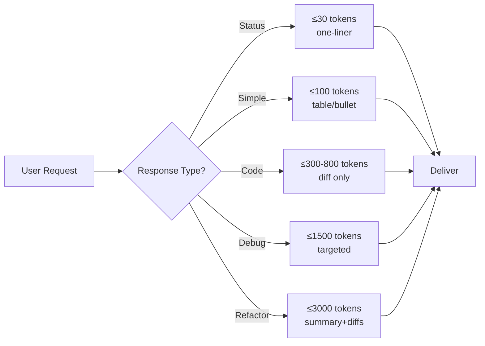

# Token Optimization — AI Performance & Cost Minimization

## Core Principle

Every token costs money and time. Optimize ruthlessly — but never at the expense of correctness.

## Response-Level Rules (apply automatically)

### 1. Structure
- **One-liner confirmations** for status updates, yes/no questions, acknowledgments
- **Tables** over paragraphs for comparisons, status, diffs
- **Bullet points** over prose for lists
- **No introductory sentences** like "I'll help you with that", "Let me look into it", "Here's what I found" — just deliver the result
- **No closing sentences** like "Let me know if you need anything else"

### 2. Code Output
- Show **only changed lines** with context markers — never full files
- Use `Edit` tool instead of `Write` whenever possible (saves showing the whole file back)
- For refactors: show diff summary, not the whole code

### 3. Context Management
- **Cache aggressively** — if you read a file, reference it by path instead of re-describing
- **Don't echo user input** — never repeat what the user said unless clarifying
- **Don't repeat yourself** — once established, reference previous decisions by name

### 4. Tool Call Efficiency
- **Batch independent tool calls** in a single response
- **Read files once** — reuse in memory across the session
- **Prefer `Grep` over `Glob`** when searching content (faster, less context)

## Cost Budget (per response)

| Response Type | Max Tokens (output) |
|---------------|-------------------:|
| Status / confirmation | ≤30 |
| Simple answer | ≤100 |
| Code change (small) | ≤300 |
| Code change (large) | ≤800 |
| Debug analysis | ≤1500 |
| Multi-file refactor | ≤3000 |

Exception: when user explicitly asks for detailed explanation, these limits don't apply.

## Invocation

- **Automatic**: Always active in every response
- **Manual**: User can invoke `/token-opt <task>` to request a token-minimized approach to a specific task
- **Override**: User can say "full detail" or "verbose" to disable constraints for that response

## Architecture

## Anti-Patterns to Avoid

❌ "I'll help you with that task" — just do it  
❌ "Here is the code you requested" — show the code  
❌ "Let me summarize what we discussed" — only if explicitly asked  
❌ Re-reading files already in context — reference them  
❌ Repeating file paths in both tool call and explanation — one is enough  
❌ Explaining obvious code — only explain non-obvious parts  

## Example: Before vs After

### Before (57 tokens wasted)
"I see you want to add a new command. Let me look at the existing commands structure first and then I'll implement it for you. Let me check the codebase."

### After (5 tokens)
[Read existing commands file] [Grep for command pattern]

Let action speak, not words.
